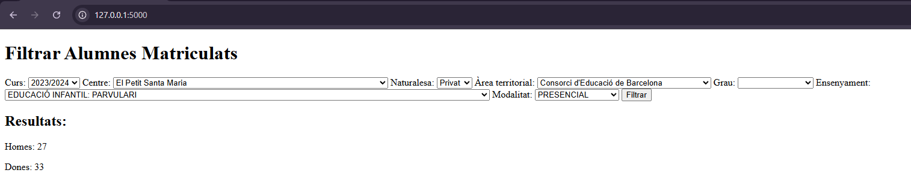

! IMPORTANTE !
No he podido subir el archivo csv ya ques muy grande y no me dejaba, la ruta es data/dataset.csv
- Los nombres de las columnas son distintas ya que daba fallo con los caracteres, importante cambiar en csv: 
Curs,Any,Codi_centre,Denominacio_completa,Codi_naturalesa,Nom_naturalesa,Codi_titularitat,Nom_titularitat,Codi_area_territorial,Nom_area_territorial,Codi_comarca,Nom_comarca,Codi_municipi_5,Codi_municipi_6,Nom_municipi,Codi_districte_municipal,Nom_districte_municipal,Coordenades_UTM_X,Coordenades_UTM_Y,Coordenades_GEO_X,Coordenades_GEO_Y,Codi_estudis,Nom_estudis,Tematica,Grau,Codi_ensenyament,Nom_ensenyament,Nivell,Matricula_concertada,Modalitat,Periode_matricula,Matricules_Total,Matricules_Dones,Matricules_Homes,Unitats,Georeferencia
Imagen de prueba: 

